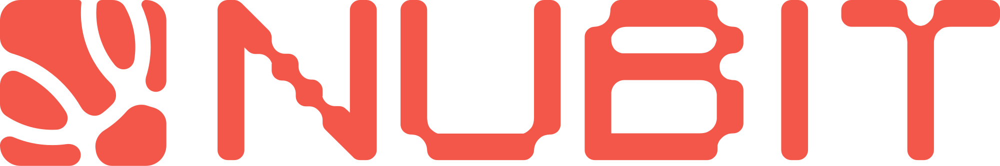

# Nubit-da-sdk [](https://discord.gg/5sVBzYa4Sg) [](https://twitter.com/Nubit_org)



## Usage
```go
package main

import (
	"context"
	"fmt"

	sdk "github.com/RiemaLabs/nubit-da-sdk"
	"github.com/RiemaLabs/nubit-da-sdk/constant"
	"github.com/RiemaLabs/nubit-da-sdk/types"
)

func main() {
	// Initialize context and SDK settings
	ctx := context.Background()
	// Set network to mainnet
	sdk.SetNet(constant.MainNet)
	client := sdk.NewNubit(sdk.WithCtx(ctx),
		sdk.WithInviteCode("7mkEPWPBBrMr12WKNsL2UALvqYfbox"),// Set invite code
		sdk.WithPrivateKey("9541ea760acc451684d28033566379a95bfe5a1b4da4a56a7df6055e4fa93eac")) // Set private key
	if client == nil {
		panic("client is nil") // Panic if the client creation fails
	}
	// Create a namespace
	ns, err := client.CreateNamespace("test", "Private", "1JqocHHUBgLKZxzQpCqrrzMnV6QV4XrUJr", []string{"18JTw53V9MMtGax7es3GMPQHwjpjNFyPj1", "1JqocHHUBgLKZxzQpCqrrzMnV6QV4XrUJr"})
	if err != nil {
		panic(err) // Print created namespace information
	}
	fmt.Println("namespace:", ns)
	// Query transaction details
	transaction, err := client.Client.GetTransaction(ctx, &types.GetTransactionReq{
		TxID: ns.TxID, // Query transaction info by namespace's transaction ID
	})
	if err != nil {
		fmt.Println(err)// Print error message if query fails
		return
	}

	fmt.Println("transaction:", transaction)
	// Upload file
	upload, err := client.Upload("/Users/{USER}/Documents/RiemaLabs/nubit-da-sdk/test/main.go", transaction.NID,0) // If the fee is 0, it will be obtained automatically, but of course it can also be obtained through the client. GetEstimateFee, 0 is recommended
	if err != nil {
		fmt.Println(err)// Print error message if file upload fails
		return
	}
	// Print upload result
	fmt.Println("upload:", upload)

}


```